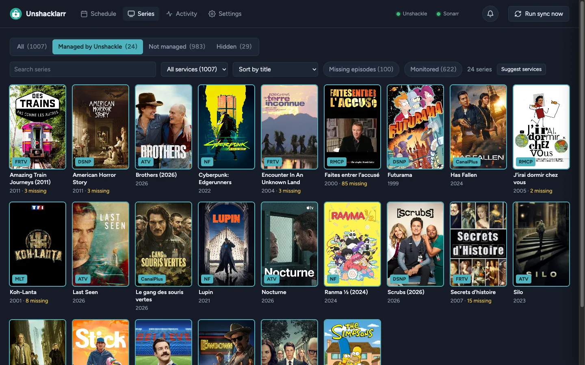
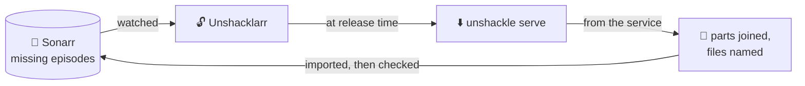
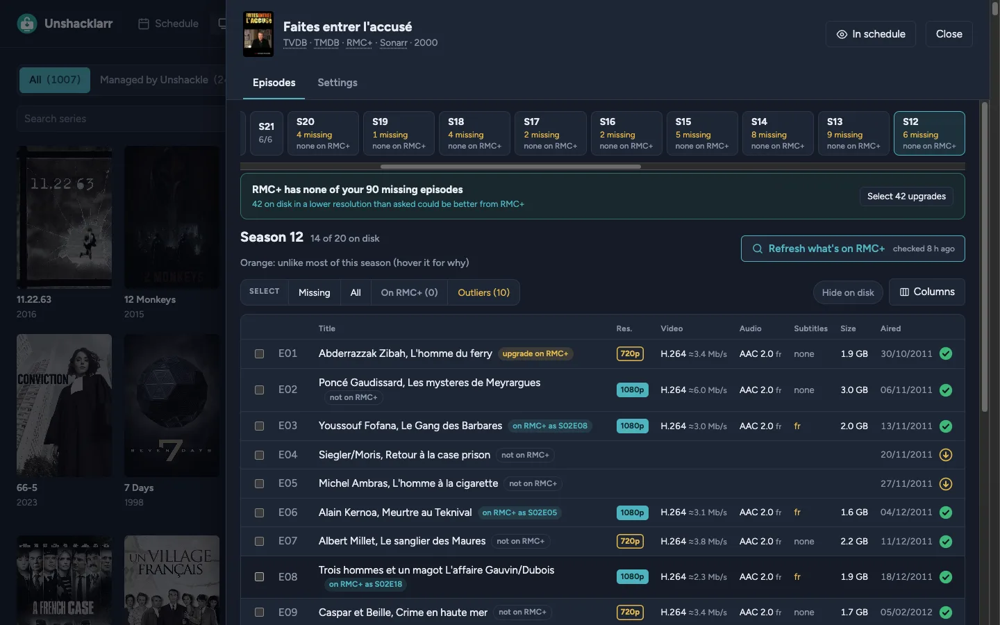
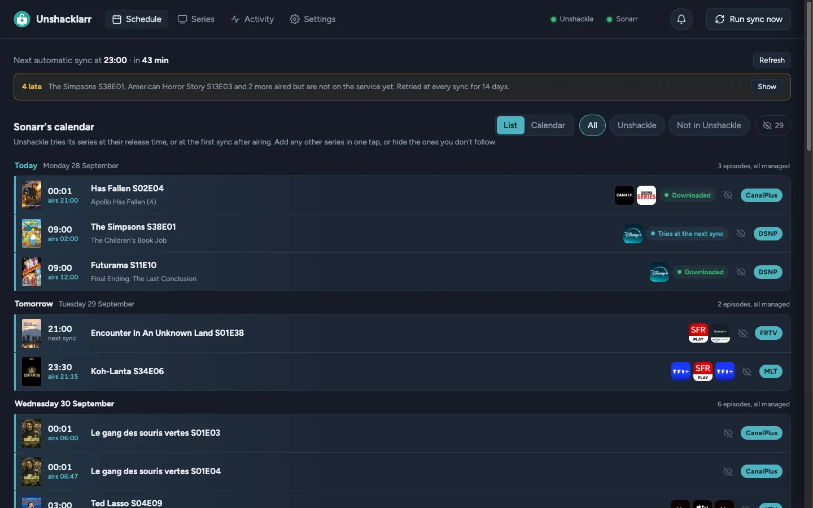
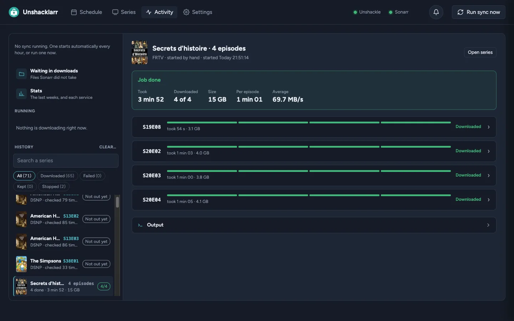
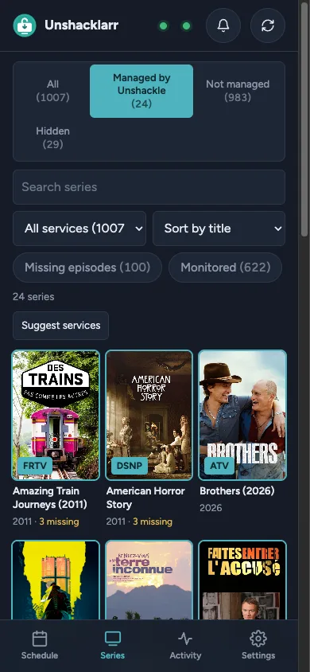
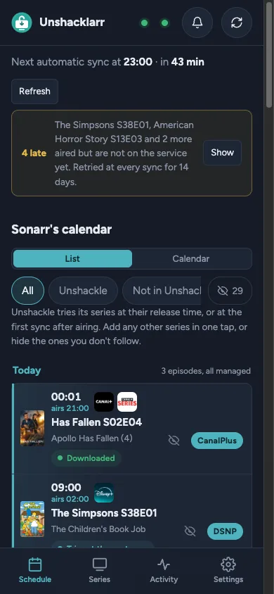
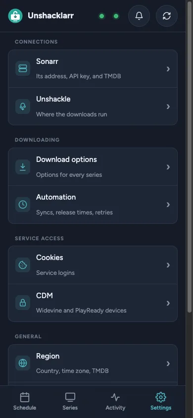

<p align="center">
  
</p>

<h1 align="center">Unshacklarr</h1>

<p align="center">
  <b>The episodes Sonarr is missing, downloaded by <a href="https://github.com/unshackle-dl/unshackle">Unshackle</a> and imported by Sonarr.</b><br>
  For those who already download with Unshackle and keep their series in Sonarr: pick a streaming service for a series once, and its new episodes land in your library on their own.
</p>

<p align="center">
  
  
  
  
  
  
</p>

<p align="center">
  <a href="https://unshacklarr.ownzzzz.workers.dev"></a>
  <a href="#quick-start"></a>
  <a href="https://discord.gg/5HmNgaGASy"></a>
  <a href="CHANGELOG.md"></a>
</p>

<p align="center">
  <a href="#how-it-works">How it works</a> ·
  <a href="#features">Features</a> ·
  <a href="#tour">Tour</a> ·
  <a href="#quick-start">Quick start</a> ·
  <a href="#reverse-proxy">Reverse proxy</a> ·
  <a href="#configuration">Configuration</a> ·
  <a href="#api">API</a> ·
  <a href="#community">Community</a> ·
  <a href="#security">Security</a>
</p>

<p align="center">
  <br>
  📺 <b>Series</b>: your Sonarr library as posters, each with its streaming service, picked by hand or from a link found on TMDB.
</p>

<a name="how-it-works"></a>

## 🔄 How it works



1. 👀 **It watches Sonarr** for episodes that aired and are still missing.
2. ⬇️ **It asks Unshackle** to download each one, at the series' release time when it has one, else
   at the next sync after it airs.
3. 🧹 **It tidies the files**: split parts joined back, named after Sonarr's series and numbering.
4. 📥 **It hands them to Sonarr**, which imports them like any other download, and checks it did.

<a name="features"></a>

## ✨ Features

<table>
  <tr>
    <td width="50%" valign="top">⏰ <b>The right time</b><br>A series' release time, in your time zone: tried then every 30 s for 10 minutes, else at the regular sync, for 14 days after airing.</td>
    <td width="50%" valign="top">🔢 <b>Numbering that differs</b><br>Season maps (Sonarr's season 34 is the service's 29), episode and season offsets, and per-episode exceptions, down to one part.</td>
  </tr>
  <tr>
    <td valign="top">🔎 <b>What a service has</b><br>A series' episodes on the service, without downloading anything, matched by title when the service numbers them its own way.</td>
    <td valign="top">🛡️ <b>No downgrades</b><br>A file Sonarr has is only replaced by a better one, as the series' quality profile ranks them, unless you ask.</td>
  </tr>
  <tr>
    <td valign="top">🧩 <b>Episodes in parts</b><br>Joined into one file, or kept apart when Sonarr counts each part, and never imported half when a series waits for all of them.</td>
    <td valign="top">🍪 <b>Cookies and CDMs</b><br>Unshackle's cookie files with their expiry, its Widevine and PlayReady devices with a test license, and the device of each service.</td>
  </tr>
  <tr>
    <td valign="top">🔔 <b>Notifications</b><br>Discord, Telegram, ntfy, Pushover, e-mail and <a href="https://github.com/caronc/apprise#supported-notifications">100 more</a>, each address with the messages you tick for it, and quiet hours.</td>
    <td valign="top">💚 <b>Health</b><br>Lights for Unshackle and Sonarr, and a message when one goes down, comes back, or when cookies or a device are about to fail.</td>
  </tr>
  <tr>
    <td valign="top">📱 <b>On a phone</b><br>An installable app with a tab bar, live progress and push notifications, once the page is served over HTTPS.</td>
    <td valign="top">🌍 <b>Your language</b><br>English, French, Spanish, German, Brazilian Portuguese, Italian, Russian, Simplified Chinese and Japanese, notifications included.</td>
  </tr>
</table>

<a name="tour"></a>

## 📸 Tour

> [!TIP]
> **Rather click than read?** The **[live demo](https://unshacklarr.ownzzzz.workers.dev)** is the real page, in your
> browser, with a guided tour. Everything in it is made up: no Sonarr, no Unshackle, nothing downloaded.

<table>
  <tr>
    <td width="50%" valign="top"><br>🎞️ <b>A series</b>: each episode's resolution, codecs, languages and size, and what the service has.</td>
    <td width="50%" valign="top"><br>📅 <b>Schedule</b>: the coming episodes by day, when each is tried, the late ones in one banner.</td>
  </tr>
  <tr>
    <td valign="top"><br>📈 <b>Activity</b>: downloads live, track by track, then their history and stats per week and per service.</td>
    <td valign="top" align="center">  <br>📱 <b>On a phone</b>: the same app, with a tab bar.</td>
  </tr>
</table>

<a name="quick-start"></a>

## 🚀 Quick start

You need:

- ⬇️ **Unshackle** 5.4.0 or later, set up with its services, cookies and CDMs;
- 📡 **Sonarr** v4, or v3;
- 🎞️ **MKVToolNix** (`mkvmerge`, `mkvpropedit`), which Unshackle needs too; the Docker image has it.

> [!NOTE]
> A few extras need what Unshackle itself does not have yet: describing, testing and reprovisioning
> CDM devices, downloading through a remote server (`--remote`), answering a service's question
> during a download (a code sent by e-mail), a TV login's link and code, and Unshackle's own log,
> live in Activity. Without them, everything else works.

**Docker** pulls Unshacklarr's image and runs Unshackle in a container of its own too, built once from
its source (on an x86-64 host). **On the computer where Unshackle runs**, Unshacklarr uses the
Unshackle you already have.

### 🐳 With Docker

1. **Get the two files** it takes, in a folder of their own:

   ```bash
   mkdir unshacklarr && cd unshacklarr
   curl -fsSLo docker-compose.yml https://raw.githubusercontent.com/OwnzZzZ/Unshacklarr/main/docker-compose.example.yml
   curl -fsSLo .env https://raw.githubusercontent.com/OwnzZzZ/Unshacklarr/main/.env.example
   ```

2. **Fill in `.env`:**

   | In `.env` | What to put |
   |---|---|
   | `PUID`, `PGID` | The user and group Sonarr runs as, so that it can move the files. |
   | `TZ` | Your time zone, e.g. `Europe/Paris`: release times use it. |
   | `DOWNLOADS_DIR` | A folder of this host for the downloads, that Sonarr's container mounts too. |
   | `SONARR_DOWNLOADS` | That same folder, as Sonarr sees it in its container. |
   | `UNSHACKLE_API_KEY` | A long random string (`openssl rand -hex 32`), also given to `unshackle.yaml` below. |
   | `SONARR_URL` | Sonarr as this container reaches it (see step 5). |

3. **Give it your Unshackle config**: `unshackle.yaml`, `Cookies/`, `WVDs/` and `PRDs/` in
   `./unshackle`, your services in `./services` (Unshackle itself ships only an `EXAMPLE` one). In
   `unshackle.yaml`, add the API key, and the folders as the container sees them (by default,
   Unshackle looks for them in its own install, which it cannot write):

   ```yaml
   serve:
     api_secret: the-UNSHACKLE_API_KEY-of-.env
   directories:
     cookies: /config/unshackle/Cookies
     wvds: /config/unshackle/WVDs
     prds: /config/unshackle/PRDs
     cache: /data/cache
     temp: /data/temp
     logs: /data/logs
   ```

4. **Create the folders it mounts**, so that Docker does not create them owned by root:

   ```bash
   mkdir -p data unshackle-data "$(grep ^DOWNLOADS_DIR= .env | cut -d= -f2)"
   ```

5. **Reach Sonarr**: if it runs in another compose project, uncomment the `networks:` lines of
   `docker-compose.yml` with the name of its network (`docker network ls`). Otherwise set
   `SONARR_URL` to an address this container can reach, such as `http://<the host's IP>:8989`; not
   `localhost`, which is the container itself.

6. **Start it** (the first time, it builds Unshackle's container: a few minutes), read the setup code
   in its log, and open **http://&lt;server&gt;:8788**:

   ```bash
   docker compose up -d
   docker logs unshacklarr
   ```

The setup asks for a password, Sonarr's URL and API key (in Sonarr › Settings › General) and
[the downloads folder as Sonarr sees it](#downloads-folder). Then, in **Series**, pick a service for
each series you want.

**Updating:** `docker compose pull && docker compose up -d` brings a new Unshacklarr; for a new
Unshackle, `docker compose build --pull unshackle && docker compose up -d`.

<details>
<summary><b>🍴 A fork of Unshackle, or a <code>serve</code> that already runs elsewhere</b></summary>

- **A fork**: build Unshackle's image from it, then start as above.

  ```bash
  docker compose build --build-arg UNSHACKLE_REPO=<its git URL> --build-arg UNSHACKLE_REF=<branch> unshackle
  docker compose up -d
  ```

- **`unshackle serve` already running somewhere**: leave the `unshackle` service and the
  `depends_on: [unshackle]` line out of `docker-compose.yml` (nothing is built then), and in the
  setup pick **Remote**, with its address and API key.

</details>

### 🖥️ On the computer where Unshackle runs

```bash
uv tool install git+https://github.com/OwnzZzZ/Unshacklarr.git
# or: pipx install git+https://github.com/OwnzZzZ/Unshacklarr.git
unshacklarr
```

Open **http://localhost:8788**, enter the **setup code** printed at start, and pick **Local**:
Unshacklarr starts `unshackle serve` itself, with your usual `unshackle.yaml`, and stops it when it
quits. The setup then asks for the same as with Docker.

> [!TIP]
> If `unshackle` is not on your `PATH` (a git clone run with `uv run`), give the full path to it in
> the **Unshackle command** field, e.g. `/home/you/unshackle/.venv/bin/unshackle` (no `~`).

Stuck somewhere? Ask on the **[Discord](https://discord.gg/5HmNgaGASy)**.

<a name="reverse-proxy"></a>

## 🛡️ Reverse proxy

> [!WARNING]
> **Do not open port 8788 to the internet.** Unshacklarr holds the keys to your Sonarr, to your
> Unshackle and its devices: keep it on your network, and reach it from outside only through a
> reverse proxy, a VPN or a firewall that chooses who gets in.

| Put in front of it | What it gives |
|---|---|
| 🔀 **A reverse proxy**: Nginx Proxy Manager, Caddy, Traefik | HTTPS, which the phone app and its notifications need, and a second lock before the page: an access list, basic auth, or a sign-in such as Authelia or Authentik. |
| 🔐 **A VPN**: WireGuard, Tailscale | The page reachable from your own devices only, as if at home. |
| 🧱 **A firewall** | Port 8788 open to your network only, never forwarded by the router. |

Behind a reverse proxy:

- **Publish the port to the proxy only**: `127.0.0.1:8788:8788` in `docker-compose.yml` when the
  proxy runs on the same host, or no `ports:` at all when it shares a Docker network with Unshacklarr.
- **Pass on the client's address and the scheme**: `X-Real-IP`, as the login limit counts tries per
  address (and trusts that header from a private address only), and `X-Forwarded-Proto`, so that
  the session cookie is marked `Secure` over HTTPS. Nginx Proxy Manager sends both.
- **Let WebSockets and streams through**: Activity's output is a WebSocket and its live view a
  stream (in Nginx Proxy Manager, turn on *Websockets Support*).
- **Sign in once, at the proxy** (optional): when Authelia or Authentik already asks who you are,
  Settings, Account, *Sign in through a reverse proxy* takes the header that names you (`Remote-User`)
  and the proxy's addresses. The header is believed from those addresses only; the password is still
  asked again before the most sensitive changes.

<a name="configuration"></a>

## ⚙️ Configuration

Everything is set in the page; these are the parts worth knowing before you start.

<a name="downloads-folder"></a>

### 📂 The downloads folder

An episode downloads into its own folder, `unshackle-<tvdb id>-S01E02`, inside a downloads folder
that three programs reach: Unshacklarr (to join parts and rename), Unshackle (to write the files)
and Sonarr (to import them). Each may see it at another path:

| Setting | The downloads folder… | Empty means |
|---|---|---|
| **Downloads folder** (Settings › Unshackle) | as Unshacklarr sees it | a `downloads` folder in Unshacklarr's settings folder |
| **Downloads folder, as Unshackle sees it** (Remote only) | as `unshackle serve` sees it | the same path |
| **Downloads folder, as Sonarr sees it** (Settings › Sonarr) | as Sonarr sees it | the same path |

With the example compose file, both containers mount `DOWNLOADS_DIR` at `/downloads`; a Sonarr that
mounts its parent folder at `/downloads` sees it as `/downloads/unshacklarr`, the value of
`SONARR_DOWNLOADS` in `.env.example`.

> [!NOTE]
> A folder that stays there is an episode waiting for Sonarr: it is not downloaded again. When
> Sonarr keeps its own file (the download was not better), you get a warning, and the folder waits
> in Activity › Waiting in downloads, to import anyway or delete. After 14 days it is deleted
> (Settings › Automation › Delete them after; 0 keeps them).

**Download only** (Settings › Automation › After the download, or a series' own page): the episode is
downloaded, checked and named, then waits in Activity › Waiting in downloads for you to import it by
hand. Those folders are never deleted on their own.

**Other Unshackle servers** (Settings › Unshackle): more `unshackle serve`, one behind a VPN say, each
with its address, API key and the downloads folder as it sees it. A service downloads with the one
picked for it in Settings › Download options › Per service; a service only one of them has goes to it.
Its downloads folder left empty is the main server's. Each one is watched: its state shows in Settings, and you
are told when it goes down and when it is back.

**Catch up** (Activity): the automatic sync only takes new episodes. The aired episodes your series still miss
(those from before a series got its service, or that the sync gave up on) are listed there, within 7, 30 or 90
days or all, and downloaded together.

### 🎛️ Download options

Options are Unshackle's own, written as on its command line (`--quality 1080`, `--a-lang fr`).
They stack in three levels, each overriding the one before: **defaults** for every series, **per
service** (`--proxy ca` for one service), then **per series**. The Schedule shows each download as
the `unshackle dl` command it amounts to.

**Quality ladders** (Settings › Quality) go further than a fixed `--quality`: an ordered list of steps
(a codec, a range, a height from… to…), tried against the episode's real tracks just before the
download. The first step it has a track for sets the quality, codec and range asked for; when none does,
the episode fails with the tracks it has, and nothing outside the ladder is downloaded. Three come
built in (1080p, 4K then 1080p, Archival). A ladder is picked for every series, per service, or per
series, the same three levels as the options. A track is measured as Unshackle's `--quality` does, by its
16:9 height (a 1920x800 film is 1080p). A ladder can also hold an audio and a subtitle language order (en-AU,
then en), used unless the series or its service sets `--a-lang` or `--s-lang`.

### 🔑 Cookies and CDMs

Settings › Cookies and Settings › CDM manage Unshackle's own files: its cookie files, its Widevine
(`.wvd`) and PlayReady (`.prd`) devices, and which device each service uses (the `cdm:` section of
`unshackle.yaml`, where only that service's line changes). Unshackle reads them anew for every
download. Unshacklarr must see those files:

- **on the same computer**, it asks Unshackle where they are;
- **with Docker**, mount Unshackle's config folder in both containers and set
  `UNSHACKLE_CONFIG_DIR`, as `docker-compose.example.yml` does;
- a `serve` on **another machine** with no shared folder keeps them to itself.

Describing, testing and reprovisioning devices goes through `unshackle serve`, which has the DRM
libraries.

### 📁 Where things are kept

| | Settings, history and caches |
|---|---|
| 🐧 Linux | `~/.config/unshacklarr` |
| 🍎 macOS | `~/Library/Application Support/Unshacklarr` |
| 🪟 Windows | `%APPDATA%\Unshacklarr` |
| 🐳 Docker | `/data`, that is `./data` next to `docker-compose.yml` |

`UNSHACKLARR_DATA` moves them. The page listens on port `8788` on every address; `PORT` and `HOST`
change that.

<a name="api"></a>

## 🧰 Options worth knowing

These are off until you turn them on:

- **Add audio track** (Settings › Download options › Languages). When your preferred audio
  language becomes available, only that audio track is downloaded and added to the file in your library. Sonarr then
  imports the updated file. Unshacklarr needs access to your library: set its folder as Sonarr sees it and as
  Unshacklarr sees it. If the file can't be found, the whole episode is downloaded instead.
- **Fallback service** (on a series page, in Source). A second service and the series URL on it, used when the main
  service doesn't have the episode yet, or not in an accepted language. If that service numbers episodes
  differently, set its `season_map` or `episode_offset` under `fallback:` in `config.yaml`.
- **Auto release times** (Settings › Automation). When 3 episodes of a series come out at the same time, that time
  becomes its release time. Release times you set yourself are never changed.
- **Download window** (Settings › Automation). Automatic downloads only run between two times, which can span
  midnight. Release-time downloads can follow it too. Episodes you start by hand are not affected.

After an update, the **What's new** button in the header lists the new options, and each one shows a "New" badge
until you have seen it.

## 💾 Backups

Settings › Account › *Backups* downloads every setting but the password (the series, their options,
the ladders, the notifications, the API keys: keep the file private), and *Restore from a file* puts one back.
Set *Back up automatically every N days*, and a backup is also saved in the data folder's `backups` folder, the
newest few kept. To rebuild an install, put a backup in that folder (or keep the file at hand), start
Unshacklarr, and choose *Restore from a backup* in the setup: the setup code and a new password are enough.

## 🔌 API

Other programs (a script, Home Assistant, iOS Shortcuts) can check on Unshacklarr, start a sync or
a download, stop one, answer a service's question and read the notifications, with a key created in
Settings › Account:

```bash
curl -H "X-Api-Key: <your key>" http://localhost:8788/api/v1/status
```

Every route and its answer: **[docs/API.md](docs/API.md)**.

<a name="community"></a>

## 💬 Community

| For | Where |
|---|---|
| 💬 Questions, help with Unshacklarr, ideas | **[Unshacklarr's Discord](https://discord.gg/5HmNgaGASy)** |
| 🐛 A bug in Unshacklarr | an [issue](https://github.com/OwnzZzZ/Unshacklarr/issues), with what Activity shows |
| 🧩 Unshackle itself: a service, a login, a CDM, a download it fails | **[Unshackle's GitHub](https://github.com/unshackle-dl/unshackle/issues)** or **[Unshackle's Discord](https://discord.gg/mHYyPaCbFK)** |
| 🔒 A security flaw | a [private security advisory](https://github.com/OwnzZzZ/Unshacklarr/security/advisories/new), never a public issue |

> [!IMPORTANT]
> **Unshacklarr only drives `unshackle serve`, through its API.** It doesn't download, log in or decrypt anything
> itself: when a service, its cookies or a CDM fail, Unshackle says so in Activity's output, and it is for
> Unshackle's own GitHub or Discord, not Unshacklarr's.

<a name="security"></a>

## 🔒 Security

> [!NOTE]
> Unshacklarr was written with an AI coding assistant. That is a reason to check it, not to take
> it on trust. Nobody can *prove* a program secure; what follows is what protects Unshacklarr,
> how it was checked, and where its limits are, so that you can judge for yourself.

Unshacklarr is a self-hosted app for **one person**. It holds the keys to your Sonarr and to
Unshackle, it can read and change Unshackle's cookie files and CDM devices (private keys), and it
decides which `unshackle` command runs: whoever has the password controls all of that, so the page
itself is what is locked down. In local mode, `unshackle serve` listens on 127.0.0.1 only, with a key
made up at each start.

| Threat | What stops it |
|---|---|
| 🚪 **Someone reaches the page** | A password (hashed with scrypt, compared in constant time), five wrong ones per address and thirty in all every 5 minutes, each counted before it is checked. The first run asks for a setup code printed in the server's log: nobody who finds a fresh install can claim it, nor see its addresses and folders. |
| 🍪 **A stolen or forged session** | The session cookie is signed (HMAC-SHA256), expires after 30 days, and is `HttpOnly`, `SameSite=Strict`, and `Secure` over HTTPS. Logging out ends it on the server too. Changing the password, or logging out other devices, ends every other session and turns off every device's push notifications. |
| 🔌 **The API key** | It opens `/api/v1` only, never the password, cookies, devices or settings, and cannot force a file to be replaced. Only its hash is kept; it is shown once, when created, after the password is asked again. |
| 🌐 **Another site acting as you (CSRF)** | Every request that changes something needs a custom header that another site's page cannot send without a CORS preflight, which the server never grants. |
| 💉 **Injected script (XSS), framing** | The page builds everything as DOM nodes with `textContent`; `innerHTML` is used only for fixed icons written in the code, never for data. Every script it runs is served by Unshacklarr itself, no CDN, and it refuses to be framed by another site. |
| 🔑 **Keys in the browser** | The keys of Sonarr, Unshackle and TMDB never reach it: the page only learns whether one is set, and a saved key is never sent to a new address unless you type it again, nor a remote CDM's secret to a new server. Notification addresses and a proxy's password reach it masked. `unshackle.yaml` shows as it is only in its editor, after the password is asked again. |
| 💾 **Secrets on disk** | `config.yaml` and the Web Push key are readable by their owner only; cookie and device files too, or by their group as well when their folder is shared by group (setgid and group-writable), never by other users. A device's private key is never sent back. |
| 📁 **Paths outside their folder** | Cookie and device names are checked against a strict pattern, anything that looks like a path is refused, and a symbolic link planted in a shared folder (`unshackle.yaml`, the downloads) is never followed. |
| 🛰️ **The server fetching what you ask (SSRF)** | Testing a Sonarr or Unshackle address needs the setup code (before setup) or a session (after). |
| 📦 **Dependencies** | Seven direct runtime dependencies (aiohttp, Apprise, PyYAML, requests, pywebpush, cryptography, py-vapid), 28 packages in all, each pinned by `uv.lock`, in the image too. DRM libraries are not among them: devices are described and tested by `unshackle serve`, which already has them. Unshackle's image checks the tools it downloads against pinned SHA-256 sums, and the CI pins what it runs. |

<details>
<summary><b>🔍 How it was checked</b></summary>

- ✅ **Tests.** Automated tests run on every push, including security regressions: a saved key or
  secret never follows a new address, secret files are readable by their owner only, names and links
  cannot lead out of their folder, wrong passwords sent at once are all counted, tokens never reach
  the page, a hostile line cannot slow translations down, the API key opens `/api/v1` only.
- 🕵️ **A full audit, with about 400 AI agents** (October 2026). Ten attack surfaces, from
  sessions to the supply chain and the public history; every finding challenged by three sceptics
  who tried to refute it, most reproduced with a script. Nothing critical nor high; the 10 medium
  findings were fixed (among them a login limit a burst could bypass, notification tokens sent to
  the page, a push device that outlived a password change, the terminal loaded from a CDN, a slow
  regular expression in translations, links planted in shared folders, unverified downloads in the
  CI and in Unshackle's image), and most low ones with them.
- 🕵️ **An earlier multi-agent review** found three lower-severity issues, fixed since: `config.yaml`
  readable by other local users, a saved key that could follow a new URL, URL tests before setup.
- 🔁 **Reviews along the way.** Changes also went through automated security reviews as they were
  made; their findings (an unsafe link scheme, a fragile admin-key check) were fixed straight away.
- 🧾 **The history.** The whole history was scanned for secrets and personal data before publishing.

</details>

> [!WARNING]
> **Limits.** No independent human audit has been done. It is built for **one trusted person**: no
> user accounts or roles. Keep it [behind a reverse proxy, a VPN or a firewall](#reverse-proxy), never
> straight on the internet.

**Lost the password?** Set a new one where Unshacklarr runs; settings and series stay:

```bash
unshacklarr reset-password
docker exec -it unshacklarr unshacklarr reset-password   # with Docker
```

<a name="versions"></a>

## 🗺️ What's new and next

Every change, version by version: **[CHANGELOG.md](CHANGELOG.md)**. Settings shows the version
running.

> [!TIP]
> **Coming next, to try now:** the [`dev-AdvancedSonarr`](https://github.com/OwnzZzZ/Unshacklarr/tree/dev-AdvancedSonarr)
> branch lets **Sonarr drive**: Unshacklarr becomes its indexer and download client (set up in one
> click), Sonarr searches, grabs and imports. Its README says what changed and how to build it; it
> does not have the API yet.

<details>
<summary><b>🛠️ Development, translations and releases</b></summary>

#### Run it from the source

```bash
uv sync --group test
uv run --group test pytest
UNSHACKLARR_DATA=/tmp/unshacklarr uv run unshacklarr
```

The page is one file, `unshacklarr/static/index.html`, with no framework and no build step. Three
things next to it are made by tools:

- its translations, `static/i18n/*.json`: `python tools/i18n/extract.py` lists the English texts in
  `en.json`, and each language's file translates them;
- the `unshackle.yaml` editor, `static/codemirror.js`: `tools/codemirror/build.sh`;
- the keys that editor offers, `static/unshackle-keys.json`: `python tools/unshackle-keys.py <an Unshackle checkout>`.

#### Make a release

1. Move the changelog's *Unreleased* entries under a new version and date, and update the compare
   links at its end.
2. Set that version in `pyproject.toml`, `unshacklarr/__init__.py` and the README's badge (its URL
   and its `alt`; a test checks they all agree with the changelog), then run `uv lock`: the CI and
   the image install with `uv sync --locked`, which stops on a lockfile that names the old version.
3. Commit, then push `main` and a tag:

   ```bash
   git tag -a v1.1.0 -m "Unshacklarr 1.1.0" && git push origin main v1.1.0
   ```

#### Continuous integration

The tests run on every push, on Forgejo (`.forgejo/workflows/ci.yml`) as on GitHub
(`.github/workflows/ci.yml`). On `main`, each also builds the image and pushes it to its own
registry as `:latest` and as the first 12 characters of the commit. A version tag `v1.1.0` adds
`:1.1.0` to that same image, not built again (`tools/ci/retag.sh`; built only if `main` has none
for the commit), and on GitHub makes the release, its notes taken from the changelog:

- GitHub: `ghcr.io/ownzzzz/unshacklarr`, with no secret to add;
- Forgejo: `<forge>/<owner>/unshacklarr`, given a `REGISTRY_TOKEN` secret (a token allowed to
  write packages).

The example compose file uses that image: a server only pulls it,
`docker compose pull unshacklarr && docker compose up -d unshacklarr`.

</details>

## 📜 License

Unshacklarr is free software under the [GNU General Public License v3.0](LICENSE), like Unshackle
and Sonarr: you may use, study, share and change it; whoever distributes it, changed or not, passes
on the same freedoms with its source.
